## Installation

Pytest is available for installation from the
[PyPI](https://pypi.python.org/pypi/allure-pytest), therefore
installation with pip is recommended. To install the latest version,
execute from the command line:

    $ pip install allure-pytest

That will install allure-pytest and allure-python-commons packages to
produce report data compatible with Allure 2. If you are using a
previous version of adapter for the [first
generation](https://pypi.python.org/pypi/pytest-allure-adaptor) of
Allure reports then you will need to uninstall it first.

## Usage

To enable Allure listener to collect results during the test execution
simply add `--alluredir` option and provide path to the folder where
results should be stored. E.g.:

    $ pytest --alluredir=/tmp/my_allure_results

To see the actual report after your tests have finished, you need to use
Allure commandline utility to generate report from the results.

    $ allure serve /tmp/my_allure_results

This command will show you generated report in your default browser.

## Basic Reporting

Your can see all default pytest statuses in the Allure report: only
tests that were not succeeded due to one of the assertion errors will be
marked as failed, any other exception will cause a test to have a broken
status.

```python
import pytest

def test_success():
    """this test succeeds"""
    assert True


def test_failure():
    """this test fails"""
    assert False


def test_skip():
    """this test is skipped"""
    pytest.skip('for a reason!')


def test_broken():
    raise Exception('oops')
```

## Supported Pytest features

Some of the common Pytest features that the Allure report supports
include xfails, fixtures and finalizers, marks, conditional skips and
parametrization.

### Xfail

This is pytest way of marking expected failures: ([Pytest
docs](https://docs.pytest.org/en/latest/skipping.html))

```python
@pytest.mark.xfail(condition=lambda: True, reason='this test is expecting failure')
def test_xfail_expected_failure():
    """this test is an xfail that will be marked as expected failure"""
    assert False


@pytest.mark.xfail(condition=lambda: True, reason='this test is expecting failure')
def test_xfail_unexpected_pass():
    """this test is an xfail that will be marked as unexpected success"""
    assert True
```

Which results in test being skipped and marked with a special tag when
it is expected to fail.

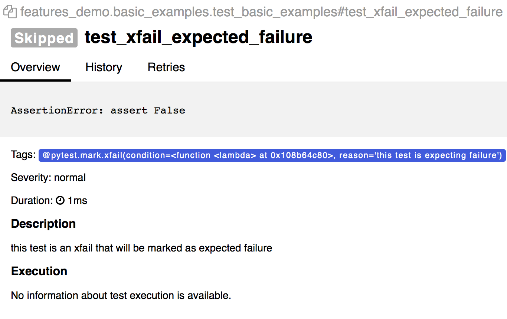

And special marking in description and a special tag when it
unexpectedly passed.

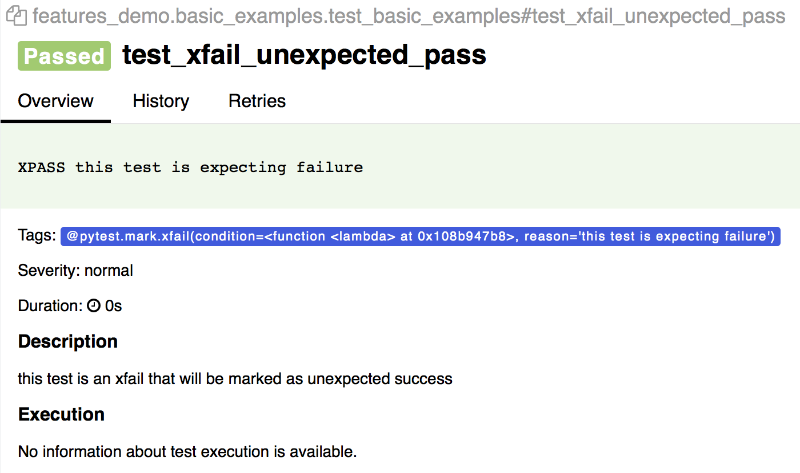

### Conditional mark

In Pytest you can conditionally mark a test to not be executed under
some specific conditions ([Pytest
docs](https://docs.pytest.org/en/latest/skipping.html)):

```python
@pytest.mark.skipif('2 + 2 != 5', reason='This test is skipped by a triggered condition in @pytest.mark.skipif')
def test_skip_by_triggered_condition():
    pass
```

When condition is evaluated to true, test receives a 'Skipped' status in
report, a tag and a description from the decorator.

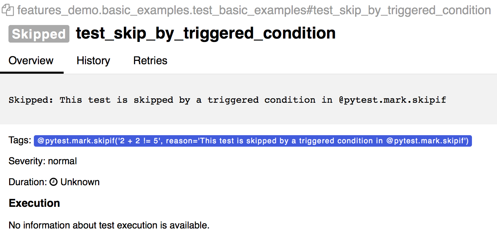

### Fixtures and Finalizers

Fixtures and finalizers are the utility functions that will be invoked
by Pytest before your test starts and after your test ends respectively.
Allure tracks invocations of every fixture and shows in full details
what methods with what arguments were invoked, preserving the correct
sequence of the calls that were made. ([Pytest
docs](https://docs.pytest.org/en/latest/reference.html#id30))

You don’t need to mark your fixtures to make them visible in the report,
they will be detected automatically for different skopes.

```python
@pytest.fixture(params=[True, False], ids=['param_true', 'param_false'])
def function_scope_fixture_with_finalizer(request):
    if request.param:
        print('True')
    else:
        print('False')
    def function_scope_finalizer():
        function_scope_step()
    request.addfinalizer(function_scope_finalizer)


@pytest.fixture(scope='class')
def class_scope_fixture_with_finalizer(request):
    def class_finalizer_fixture():
        class_scope_step()
    request.addfinalizer(class_finalizer_fixture)


@pytest.fixture(scope='module')
def module_scope_fixture_with_finalizer(request):
    def module_finalizer_fixture():
        module_scope_step()
    request.addfinalizer(module_finalizer_fixture)


@pytest.fixture(scope='session')
def session_scope_fixture_with_finalizer(request):
    def session_finalizer_fixture():
        session_scope_step()
    request.addfinalizer(session_finalizer_fixture)


class TestClass(object):

    def test_with_scoped_finalizers(self,
                                    function_scope_fixture_with_finalizer,
                                    class_scope_fixture_with_finalizer,
                                    module_scope_fixture_with_finalizer,
                                    session_scope_fixture_with_finalizer):
        step_inside_test_body()
```

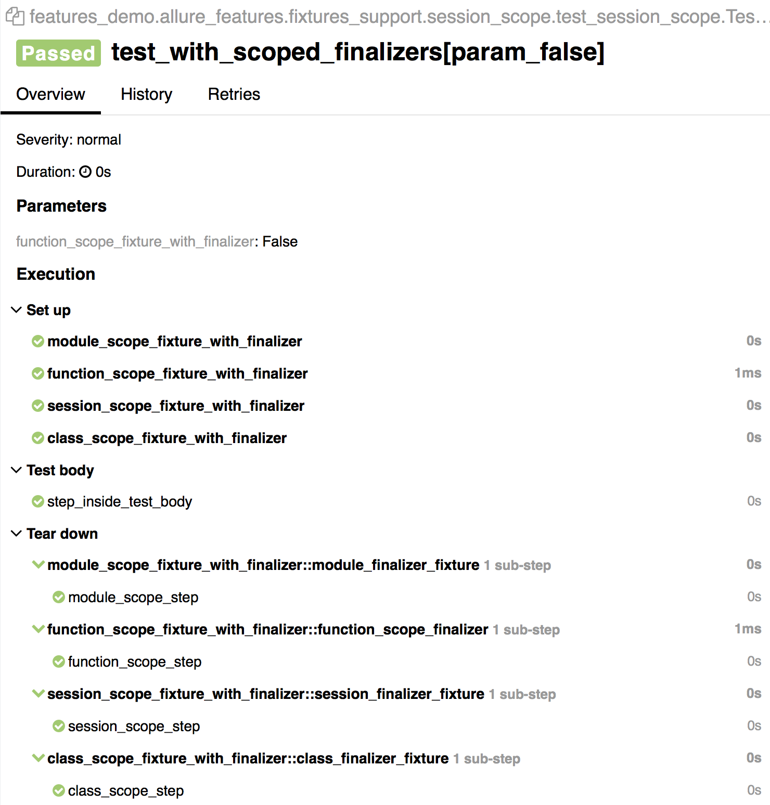

Depending on an outcome of a fixture execution, test that is dependent
on it may receive a different status. Exception in the fixture would
make all dependent tests broken, `pytest.skip()` call would make all
dependent test skipped.

```python
import pytest

@pytest.fixture
def skip_fixture():
    pytest.skip()


@pytest.fixture
def fail_fixture():
    assert False


@pytest.fixture
def broken_fixture():
    raise Exception("Sorry, it's broken.")


def test_with_pytest_skip_in_the_fixture(skip_fixture):
    pass


def test_with_failure_in_the_fixture(fail_fixture):
    pass


def test_with_broken_fixture(broken_fixture):
    pass
```

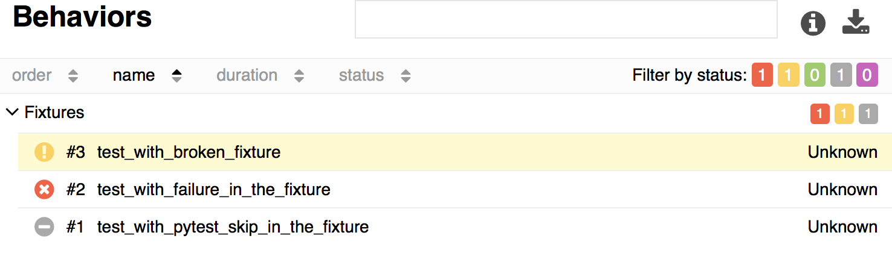

### Parametrization

You can generate many test cases from the sets of input parameters using
`@pytest.mark.parametrize`. ([Pytest docs](https://docs.pytest.org/en/latest/skipping.html))

All argument names and values will be captured in the report, optionally
argument names will be replaced with provided string descriptions in the
`ids` kwarg.

```python
import allure
import pytest


@allure.step
def simple_step(step_param1, step_param2 = None):
    pass


@pytest.mark.parametrize('param1', [True, False], ids=['id explaining value 1', 'id explaining value 2'])
def test_parameterize_with_id(param1):
    simple_step(param1)


@pytest.mark.parametrize('param1', [True, False])
@pytest.mark.parametrize('param2', ['value 1', 'value 2'])
def test_parametrize_with_two_parameters(param1, param2):
    simple_step(param1, param2)


@pytest.mark.parametrize('param1', [True], ids=['boolean parameter id'])
@pytest.mark.parametrize('param2', ['value 1', 'value 2'])
@pytest.mark.parametrize('param3', [1])
def test_parameterize_with_uneven_value_sets(param1, param2, param3):
    simple_step(param1, param3)
    simple_step(param2)
```

Example of captured test invocations with different sets of named and
unnamed parameters.

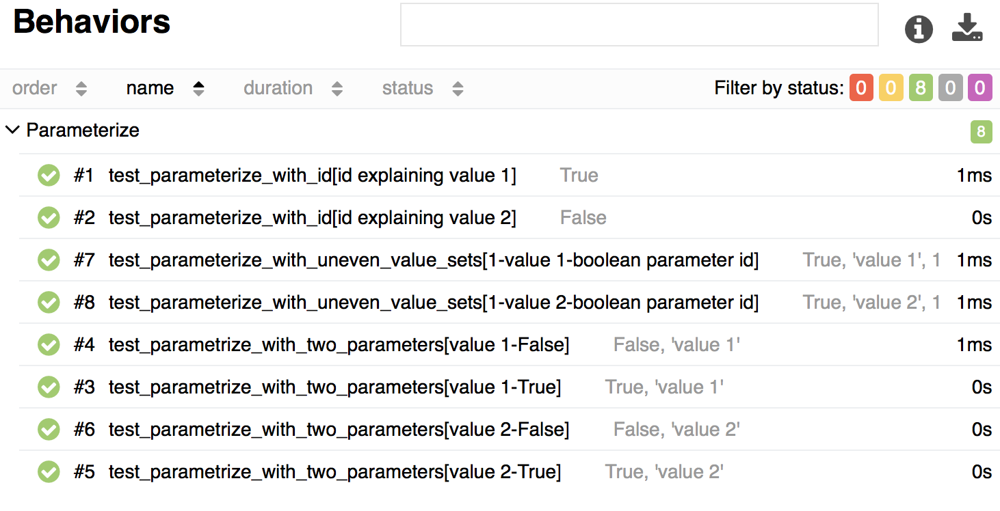

Details of test execution for a parameterized test with a named
parameter.

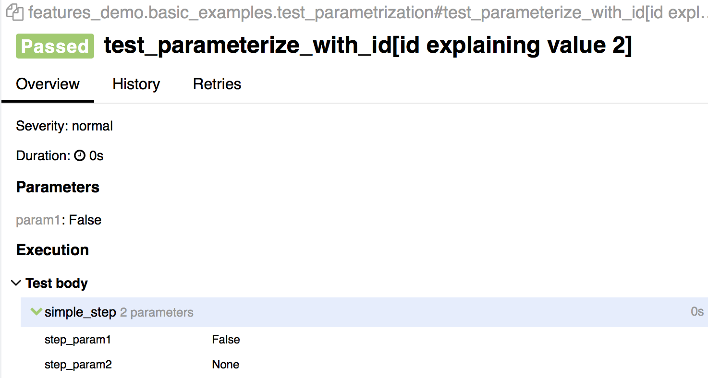

## Allure Features

Allure currently supports almost every available feature except for
environment with Pytest.

### Steps

The first and probably most important aspect of the Allure report is
that it allows to get a very detailed step-by-step representation of
every test invocation. This is made possible with `@allure.step`
decorator that adds invocation of the annotated method or function with
provided arguments to the report.

Methods annotated with `@step` can be stored aside from your tests and
just imported when needed. Step methods can have an arbitrarily deep
nested structure.

```python
import allure
import pytest

from .steps import imported_step


@allure.step
def passing_step():
    pass


@allure.step
def step_with_nested_steps():
    nested_step()


@allure.step
def nested_step():
    nested_step_with_arguments(1, 'abc')


@allure.step
def nested_step_with_arguments(arg1, arg2):
    pass


def test_with_imported_step():
    passing_step()
    imported_step()


def test_with_nested_steps():
    passing_step()
    step_with_nested_steps()
```

Status of every step is shown in a small icon on the right from the
name. Nested steps are organized in a tree-like collapsible structure.

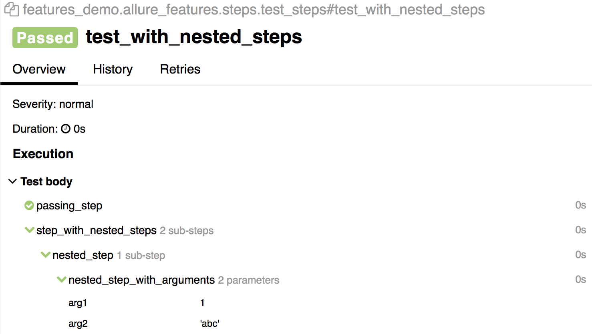

Steps can have a description line that supports placeholders for passed
positional and keyword arguments. Default parameters of the keyword
arguments will be captured as well.

```python
import allure

@allure.step('Step with placeholders in the title, positional: "{0}", keyword: "{key}"')
def step_with_title_placeholders(arg1, key=None):
    pass


def test_steps_with_placeholders():
    step_with_title_placeholders(1, key='something')
    step_with_title_placeholders(2)
    step_with_title_placeholders(3, 'anything')
```

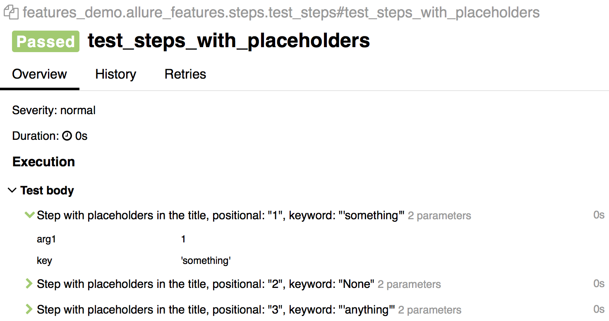

Steps are supported in fixtures as well. Here is an example of a test
using a fixture defined in `conftest.py` module (such fixtures will be
resolved by Pytest even when not directly imported):

**conftest.py.**

```python
import allure
import pytest


@allure.step('step in conftest.py')
def conftest_step():
    pass


@pytest.fixture
def fixture_with_conftest_step():
    conftest_step()

import allure

from .steps import imported_step


@allure.step
def passing_step():
    pass


def test_with_step_in_fixture_from_conftest(fixture_with_conftest_step):
    passing_step()
```

Steps in fixtures are shown in separate trees for setup and teardown.


#### Attachments

Reports can display many different types of provided attachments that
can complement a test, step or fixture result. Attachments can be
created either with invocation of
`allure.attach(body, name, attachment_type, extension)`:

1.  `body` - raw content to be written into the file.

2.  `name` - a string with name of the file

3.  `attachment_type` - one of the `allure.attachment_type` values

4.  `extension` - is provided will be used as an extension for the
    created file.

or `allure.attach.file(source, name, attachment_type, extension)`:

1.  `source` - a string containing path to the file.

(other arguments are the same)

```python
import allure
import pytest


@pytest.fixture
def attach_file_in_module_scope_fixture_with_finalizer(request):
    allure.attach('A text attacment in module scope fixture', 'blah blah blah', allure.attachment_type.TEXT)
    def finalizer_module_scope_fixture():
        allure.attach('A text attacment in module scope finalizer', 'blah blah blah blah',
                      allure.attachment_type.TEXT)
    request.addfinalizer(finalizer_module_scope_fixture)


def test_with_attacments_in_fixture_and_finalizer(attach_file_in_module_scope_finalizer):
    pass


def test_multiple_attachments():
    allure.attach.file('./data/totally_open_source_kitten.png', attachment_type=allure.attachment_type.PNG)
    allure.attach('<head></head><body> a page </body>', 'Attach with HTML type', allure.attachment_type.HTML)

```
    
Attachments are shown in the context of a test entity they belong to.
Attachments of HTML type are rendered and displayed on the report page.
This is a convenient way to provide some customization for your own
representation of a test result.

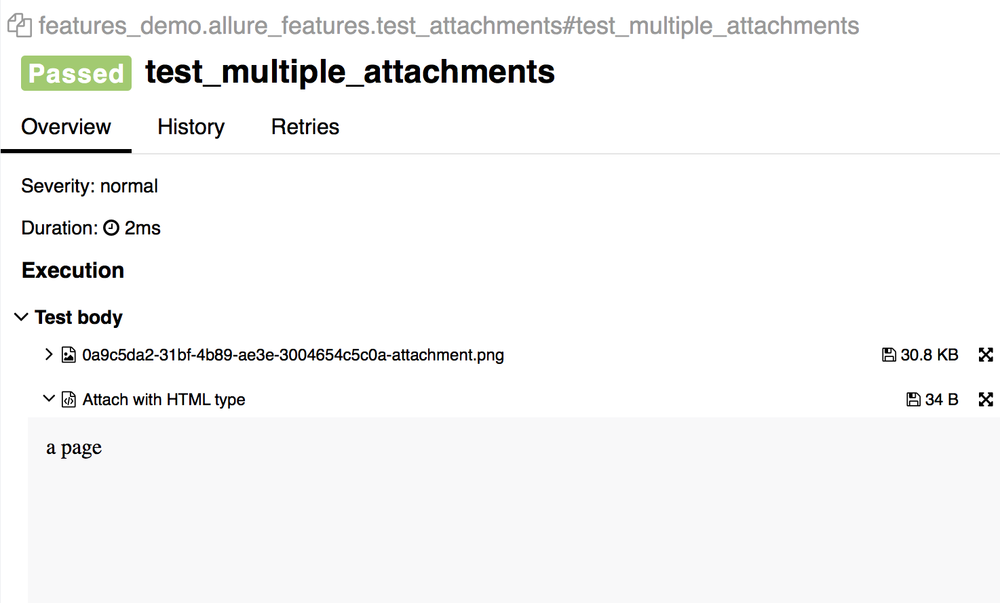

### Descriptions

You can add a detailed description for tests to provide as much context
to the report reader as you want. This can be done in several ways: you
can add a `@allure.description` decorator providing a description string
or you can use `@allure.description_html` to provide some HTML to be
rendered in the 'Description' section of a test case. Alternatively
description will be simply picked up from the docstring of a test
method.

```python
import allure

@allure.description_html("""
<h1>Test with some complicated html description</h1>
<table style="width:100%">
  <tr>
    <th>Firstname</th>
    <th>Lastname</th>
    <th>Age</th>
  </tr>
  <tr align="center">
    <td>William</td>
    <td>Smith</td>
    <td>50</td>
  </tr>
  <tr align="center">
    <td>Vasya</td>
    <td>Jackson</td>
    <td>94</td>
  </tr>
</table>
""")
def test_html_description():
    assert True


@allure.description("""
Multiline test description.
That comes from the allure.description decorator.

Nothing special about it.
""")
def test_description_from_decorator():
    assert 42 == int(6 * 7)


def test_unicode_in_docstring_description():
    """Unicode in description.

    Этот тест проверяет юникод.

    你好伙计.
    """
    assert 42 == int(6 * 7)
```

Description supports unicode strings:

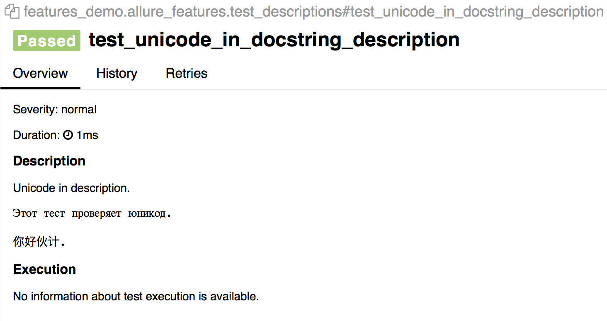

Rendered HTML from `description_html`:

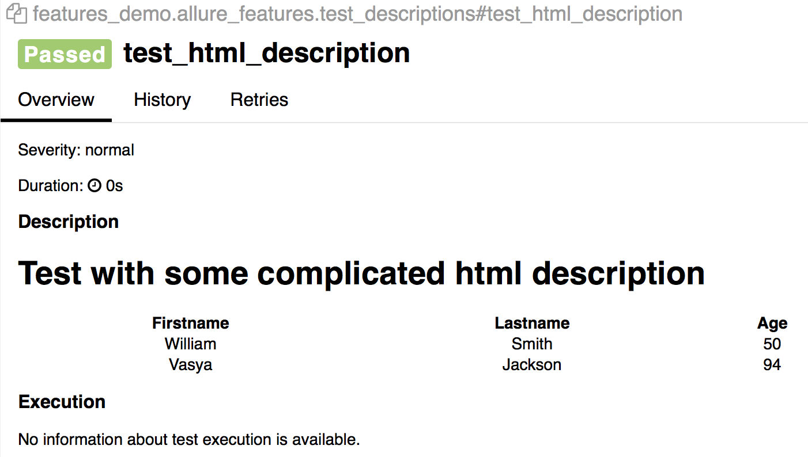

Also descriptions can be dynamically updated from within test body using
`allure.dynamic.description`.

```python
import allure

@allure.description("""
This description will be replaced at the end of the test.
""")
def test_dynamic_description():
    assert 42 == int(6 * 7)
    allure.dynamic.description('A final description.')
```

### Titles

Test titles can be made more readable with special `@allure.title`
decorator. Titles support placeholders for arguments and support dynamic
replacement.

```python
import allure
import pytest


@allure.title("This test has a custom title")
def test_with_a_title():
    assert 2 + 2 == 4


@allure.title("This test has a custom title with unicode: Привет!")
def test_with_unicode_title():
    assert 3 + 3 == 6


@allure.title("Parameterized test title: adding {param1} with {param2}")
@pytest.mark.parametrize('param1,param2,expected', [
    (2, 2, 4),
    (1, 2, 5)
])
def test_with_parameterized_title(param1, param2, expected):
    assert param1 + param2 == expected


@allure.title("This title will be replaced in a test body")
def test_with_dynamic_title():
    assert 2 + 2 == 4
    allure.dynamic.title('After a successful test finish, the title was replaced with this line.')
```

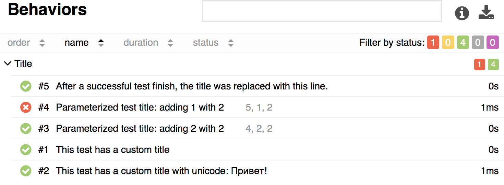

### Links

To integrate report with a bugtracker or test management system Allure
has `@allure.link`, `@allure.issue` and `@allure.testcase` descriptors.

```python
import allure

TEST_CASE_LINK = 'https://github.com/qameta/allure-integrations/issues/8#issuecomment-268313637'


@allure.link('https://www.youtube.com/watch?v=4YYzUTYZRMU')
def test_with_link():
    pass


@allure.link('https://www.youtube.com/watch?v=Su5p2TqZxKU', name='Click me')
def test_with_named_link():
    pass


@allure.issue('140', 'Pytest-flaky test retries shows like test steps')
def test_with_issue_link():
    pass


@allure.testcase(TEST_CASE_LINK, 'Test case title')
def test_with_testcase_link():
    pass
```

`@allure.link` will provide a clickable link to provided url in 'Links'
section:

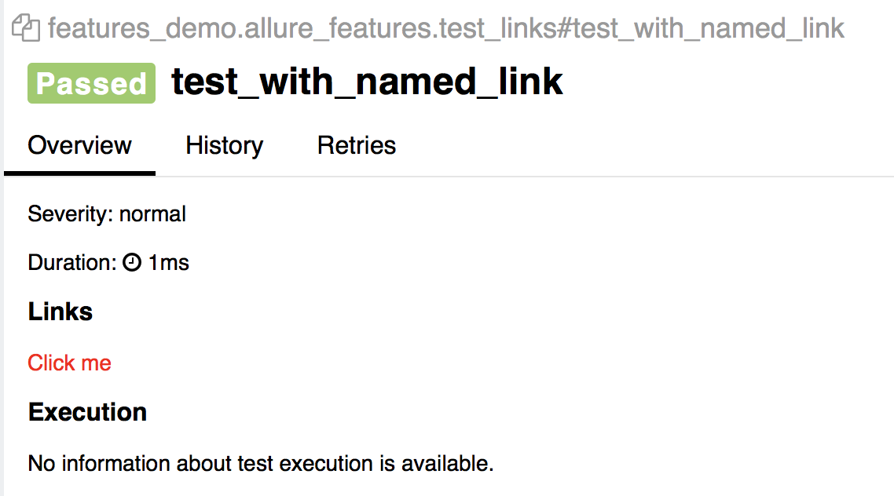

`@allure.issue` will provide a link with a small bug icon. This
descriptor takes test case id as the input parameter to use it with
provided link template for issue link type. Link templates are specified
in `--allure-link-pattern` configuration option for Pytest. Link
templates and types have to be specified using a colon:

    $ pytest directory_with_tests/ --alluredir=/tmp/my_allure_report \
     --allure-link-pattern=issue:http://www.mytesttracker.com/issue/{}

Template keywords are `issue`, `link` and `test_case` to provide a
template for the corresponding type of link.

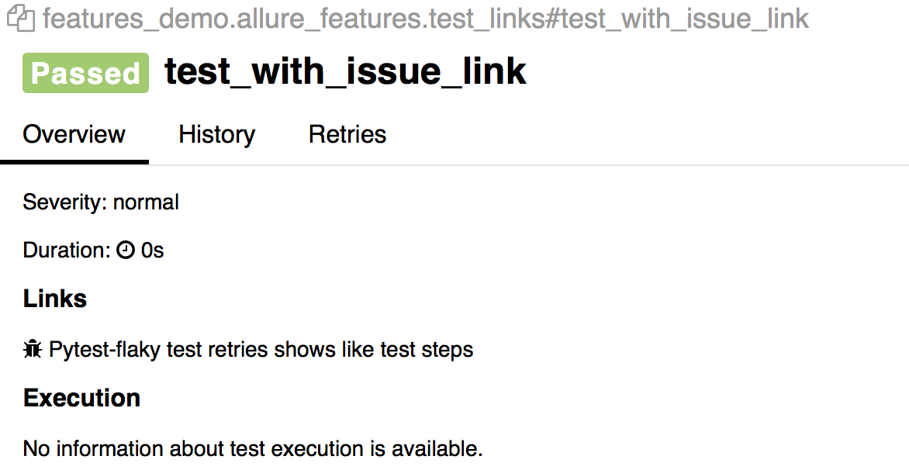

## Retries

Allure allows you to aggregate information about test being re-executed
during a single test run as well as history of test execution over some
period of time.

For retries you can use [Pytest rerun failures
plugin](https://github.com/pytest-dev/pytest-rerunfailures).

For example if we have a very unreliable step method that fails often,
after specifying `--reruns=5` in the Pytest startup options we would see
all unsuccessful attempts to run this test displayed on the `Retries`
tab.

```python
import allure
import random
import time


@allure.step
def passing_step():
    pass


@allure.step
def flaky_broken_step():
    if random.randint(1, 5) != 1:
        raise Exception('Broken!')


def test_broken_with_randomized_time():
    passing_step()
    time.sleep(random.randint(1, 3))
    flaky_broken_step()
```

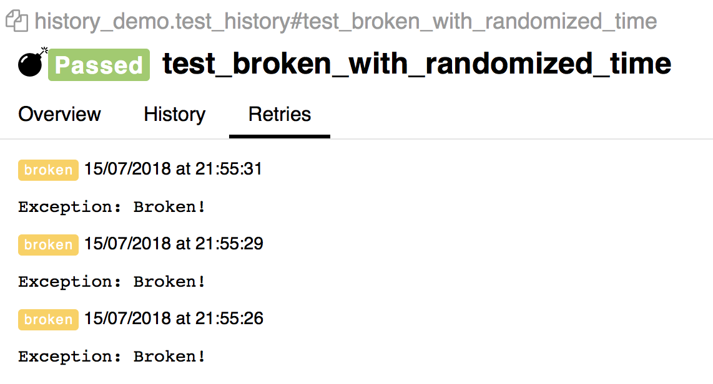

Also such a test would receive 'flaky' bomb icon in the list of executed
tests.

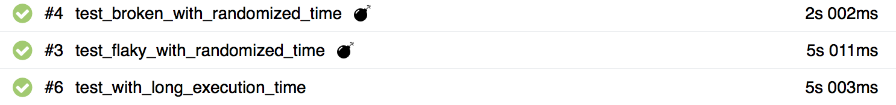

## Tags

Sometimes you want to be flexible with tests that you want to be
executed. Pytest allows that by using marker decorator `@pytest.mark`
([Pytest docs](https://docs.pytest.org/en/latest/example/markers.html)).

Allure allows to mark your tests in a similar way with 3 types of
marking decorators that allow to structure representation of your
report:

1.  BDD-style markers denoting Epics, Features and Stories

2.  Severity labels

3.  Custom labels

### BDD markers

There are two decorators: `@allure.feature` and `@allure.story` to mark
your tests according to Feature/Story breakdown specific to your project
([for background see BDD article on
Wikipedia](https://en.wikipedia.org/wiki/Behavior-driven_development)).
To mark that some feature or story belong to an epic, use a name that
starts with `epic_` prefix.

**tests.py.**

```python
import allure


def test_without_any_annotations_that_wont_be_executed():
    pass


@allure.story('epic_1')
def test_with_epic_1():
    pass


@allure.story('story_1')
def test_with_story_1():
    pass

@allure.story('story_2')
def test_with_story_2():
    pass


@allure.feature('feature_2')
@allure.story('story_2')
def test_with_story_2_and_feature_2():
    pass
```

You can use following commandline options to specify different sets of
tests to execute passing a list of comma-separated values:

1.  `--allure-epics`

2.  `--allure-features`

3.  `--allure-stories`

for example:

    $ pytest tests.py --allure-stories story_1,story_2

    collected 5 items

    tests.py ...                                                                    [100%]

    ============================== 3 passed in 0.01 seconds ==============================

    $ pytest tests.py --allure-features feature2 --allure-stories story2

    collected 5 items

    tests.py ...                                                                     [100%]

    =============================== 2 passed in 0.01 seconds ==============================

### Severity markers

To mark your tests by severity level you can use `@allure.severity`
decorator. It takes a `allure.severity_level` enum value as an argument.

**tests.py.**

```python
import allure


def test_with_no_severity_label():
    pass


@allure.severity(allure.severity_level.TRIVIAL)
def test_with_trivial_severity():
    pass


@allure.severity(allure.severity_level.NORMAL)
def test_with_normal_severity():
    pass


@allure.severity(allure.severity_level.NORMAL)
class TestClassWithNormalSeverity(object):

    def test_inside_the_normal_severity_test_class(self):
        pass

    @allure.severity(allure.severity_level.CRITICAL)
    def test_inside_the_normal_severity_test_class_with_overriding_critical_severity(self):
        pass
```

Severity decorator can be applied to functions, methods or entire
classes.

By using `--allure-severities` commandline option with a list of
comma-separated severity levels only tests with corresponding severities
will be run.

    $ pytest tests.py --allure-severities normal,critical

    collected 5 items

    bdd_annotations_demo/test_severity_labels.py ...                                [100%]

    ================================ 3 passed in 0.01 seconds ============================
