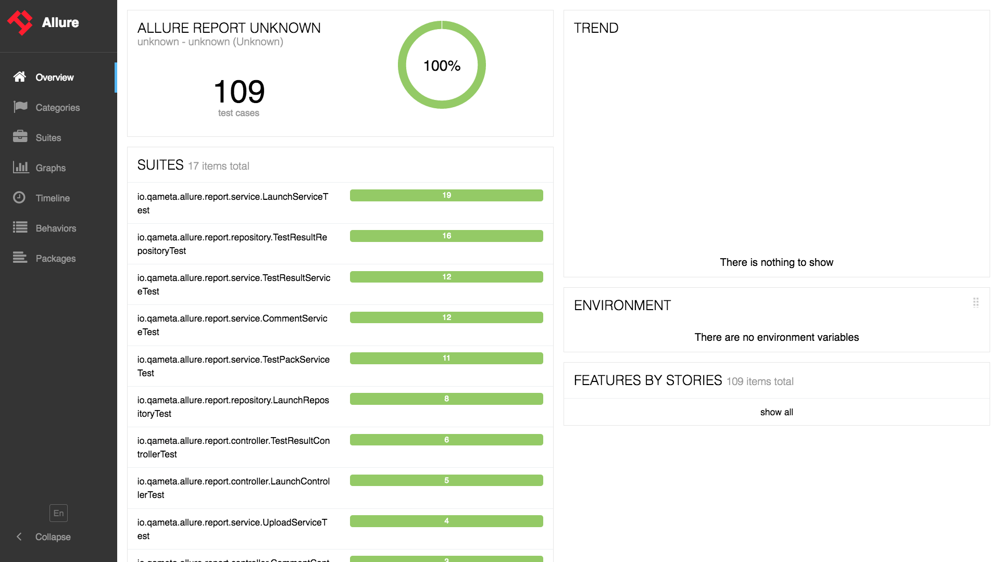

## Installation

Several options for Allure installation are currently supported:

### Linux

For debian-based repositories a PPA is provided:

```shell script
sudo apt-add-repository ppa:qameta/allure
sudo apt-get update     
sudo apt-get install allure
```

### Mac OS X

For Maс OS, automated installation is available via
[Homebrew](https://brew.sh)

```shell script
brew install allure
```

### Windows

For Windows, Allure is available from the [Scoop](http://scoop.sh/)
commandline-installer.

To install Allure, download and install Scoop and then execute in the
Powershell:

```shell script
scoop install allure
```

Also Scoop is capable of updating Allure distribution installations. To
do so navigate to the Scoop installation directory and execute

    \bin\checkver.ps1 allure -u

This will check for newer versions of Allure, and update the manifest
file. Then execute

```shell script
scoop update allure
```
    
to install a newer version.
([documentation](https://github.com/lukesampson/scoop/wiki/App-Manifest-Autoupdate))

### Manual installation

1.  Download the latest version as zip archive from [Maven Central](https://repo.maven.apache.org/maven2/io/qameta/allure/allure-commandline/).
2.  Unpack the archive to allure-commandline directory.
3.  Navigate to **bin** directory.
4.  Use **allure.bat** for Windows or **allure** for other Unix
    platforms.
5.  Add **allure** to system PATH.

To run commandline application, Java Runtime Environment must be
installed.

Older releases (⇐ 2.8.0) are available on
[bintray](https://bintray.com/qameta/generic/allure2).

### Check the installation

Execute `allure --version` in console to make sure that allure is now
available:

```shell script
$ allure --version
2.0.1
```

## Test execution

If you are using IDE to run tests locally it may ignore Allure
configuration specified in build file (as IntelliJ IDEA does). In order
to make it work consider using allure.properties file to configure
Allure. Check out [configuration section](/allure/java/cucumber-jvm) for more
information.

Before building a report you need to run your tests to obtain some basic
test report data. Typically it might be a junit-style xml report
generated by nearly every popular test framework. For example, suppose
you have test reports automatically created by surefire maven plugin
stored in the `target/surefire-reports`:


## Report generation

This is already enough to see the Allure report in one command:

`allure serve /home/path/to/project/target/surefire-reports/`

Which generates a report in temporary folder from the data found in the
provided path and then creates a local Jetty server instance, serves
generated report and opens it in the default browser. It is possible to
use a **--profile** option to enable some pre-configured allure setting.
**junit** profile is enabled by default, you will learn more about
profiles in the following [section](/allure/reporting/commandline).

This would produce a report with a minimum of information extracted from
the xml data that will lack nearly all of the advanced allure features
but will allow you to get a nice visual representation of executed
tests.


