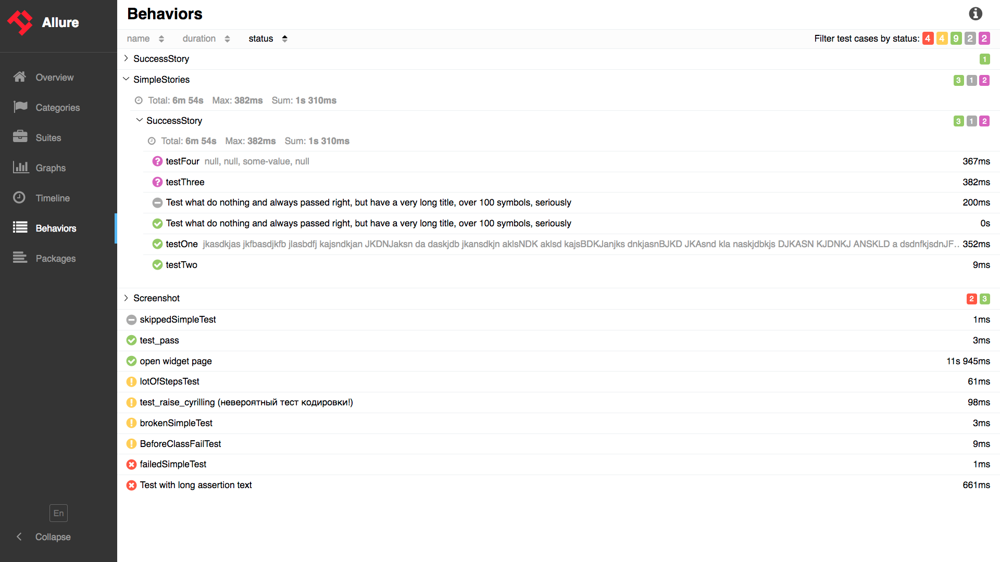

## Overview

Entry point for every report would be the 'Overview' page with
dashboards and widgets:

Overview page hosts several default widgets representing basic
characteristics of your project and test environment.

-   Statistics - overall report statistics.

-   Launches - if this report represents several test launches,
    statistics per launch will be shown here.

-   Behaviors - information on results aggregated according to stories
    and features.

-   Executors - information on test executors that were used to run the
    tests.

-   History Trend - if tests accumulated some historical data, it’s
    trend will be calculated and shown on the graph.

-   Environment - information on test environment (see [how to define environment](/allure/features/environment)).

Home page widgets are draggable and configurable. Also, Allure supports
it’s own plugin system, so quite different widget layouts are possible.

Navigation bar is collapsible and enables you to switch into several of
the basic results overview modes.

## Suites

On the Suites tab a standard structural representation of executed
tests, grouped by suites and classes can be found.

## Behaviors

For Behavior-driven approach, this tab groups test results according to
Epic, Feature and Story tags.

## Categories

Categories tab gives you the way to [create custom defects classification](/allure/features/categories) to apply for test results.

## Graphs

Graphs allow you to see different statistics collected from the test
data: statuses breakdown or severity and duration diagrams.

## Packages

Packages tab represents a tree-like layout of test results, grouped by
different packages.

## Timeline

Timeline tab visualizes retrospective of tests execution, allure
adaptors collect precise timings of tests, and here on this tab they are
arranged accordingly to their sequential or parallel timing structure.

## Test result

From some of the results overview pages described above you can go to
the test case page after clicking on the individual tests. This page
will typically contain a lot of individual data related to the test
case: steps executed during the test, timings, attachments, test
categorization labels, descriptions and links.

