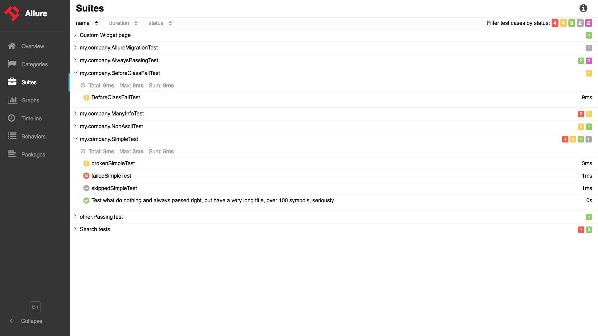

# Check this out

## Overview tab

The first thing we see after loading the Allure report is the overview tab.

Here you will find general information about the test results, for which the report is built.

1. Summary - overall report statistics.
2. Suites - shows tests grouped by suites existing in the project.
3. [Environment](../../gettingstarted_2/features_2#environment) - information about tests environment.
4. Behaviors - information about results aggregated according to epics, features and stories.
5. [History Trend](../overview/widgets) - if tests accumulated some historical data, it’s trend will be calculated and shown on the graph.
6. Categories - common information of defects.
7. [Executors](../../gettingstarted_2/quickstart_2#test-execution) - information about how results was appeared.

Overview page's widgets are draggable and configurable. Allure Report supports its own plugin system, so different widget layouts are possible.

Collapsible navigation bar contains tabs with more detailed description of the test results, see below.

## Categories

Shows known bugs grouped into [Categories](../../gettingstarted_2/features_2#categories).

## Suites

Shows test results grouped by the name of classes in the project and specified custom labels.

## Graphs

Shows the statistics collected on the basis of the testing results: [Status](../overview/widgets), [Severity](../overview/widgets), [Duration Trend](../overview/widgets), [Retries Trend](../overview/widgets), [Categories Trend](../overview/widgets), [Trend](../overview/widgets).

## Timeline

Displays the sequence of the test results according to the test execution time.

## Behaviors

Test results grouped by custom labels assigned to each test in the code. The display is implemented by the tree-like structure.

## Packages

Test results are grouped based on the structure of the project that contains the tests.

## Test result

Test results are displayed when you select a particular result from the list available on the Categories, Suites, Behaviors and Packages tabs. Described in more details [here](../test_result_page).

