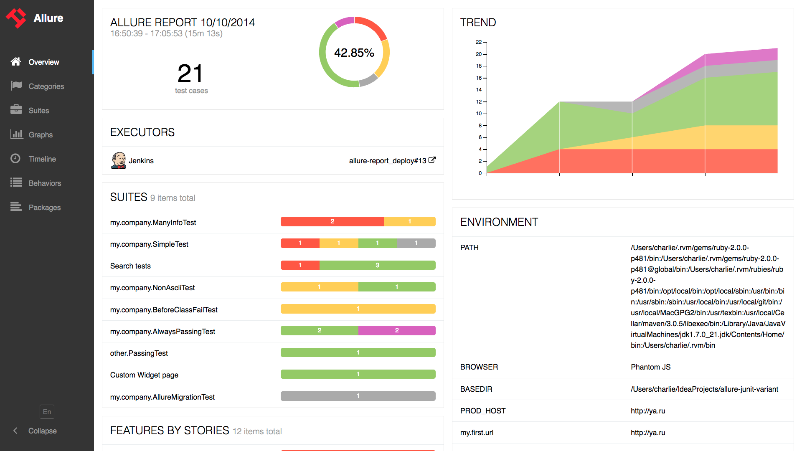

# Helicopter view

## Overview

Entry point for every report would be the 'Overview' page with dashboards and widgets:

Overview page hosts seven default widgets representing basic characteristics of your project and test environment.

-   [Summary](/content/overview/helicopterview.md) - overall report statistics.

-   [Suites](/content/overview/helicopterview.md) - shows tests grouped by suites existing in the project.

-   [Environment](/content/overview/helicopterview.md) - information on test environment.

-   [Behaviors](/content/overview/helicopterview.md) - information on results aggregated according to epics, features and stories.

-   [History Trend](/content/overview/helicopterview.md) - if tests accumulated some historical data, it’s trend will be calculated and shown on the graph.

-   [Categories](/content/overview/helicopterview.md) - information on test executors that were used to run the tests.

-   [Executors](/content/overview/helicopterview.md) - information on test executors that were used to run the tests (see [how to run tests](/content/overview/helicopterview.md)).

Home page widgets are draggable and configurable. Also, Allure supports it’s own plugin system, so quite different widget layouts are possible (see [how to configure widget](/content/overview/helicopterview.md)).

Collapsible navigation bar allows you to use additional workspace. Besides the overview, it contains tabs with a more detailed description of [test results](/content/overview/helicopterview.md):

 [Categories](/content/overview/helicopterview.md).
 [Suites](/content/overview/helicopterview.md).
 [Graphs](/content/overview/helicopterview.md).
 [Timeline](/content/overview/helicopterview.md).
 [Behaviors](/content/overview/helicopterview.md).
 [Packages](/content/overview/helicopterview.md).
 
## Categories

Categories section gives you the way to [create custom defects classification](/content/overview/helicopterview.md) to apply for test results.

## Suites

On the Suites tab a standard structural representation of executed tests, grouped by suites and classes can be found.

## Behaviors

For Behavior-driven approach, this tab groups test results according to Epic, Feature and Story tags.

## Graphs

Graphs allow you to see different statistics collected from the test
data: statuses breakdown or severity and duration diagrams.

## Timeline

Timeline tab visualizes retrospective of tests execution, allure
adaptors collect precise timings of tests, and here on this tab they are
arranged accordingly to their sequential or parallel timing structure.

## Packages

Packages tab represents a tree-like layout of test results, grouped by
different packages.

## Test result

From some of the results overview pages described above you can go to
the test case page after clicking on the individual tests. This page
will typically contain a lot of individual data related to the test
case: steps executed during the test, timings, attachments, test
categorization labels, descriptions and links.

