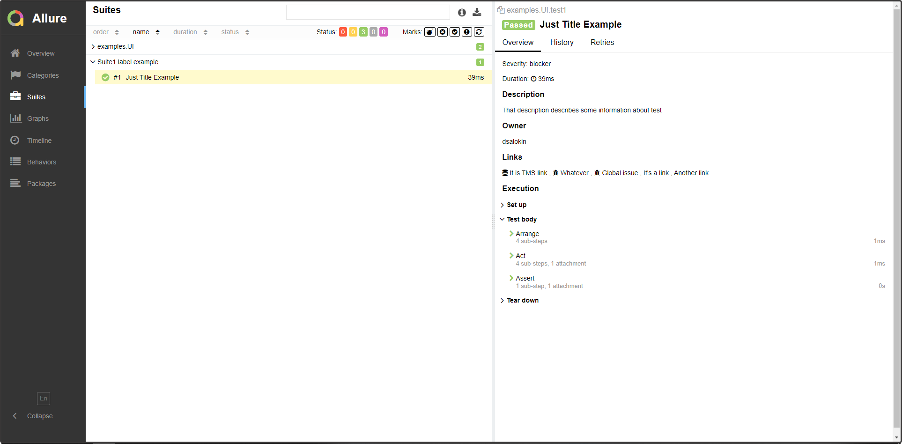
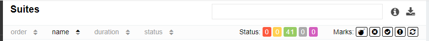
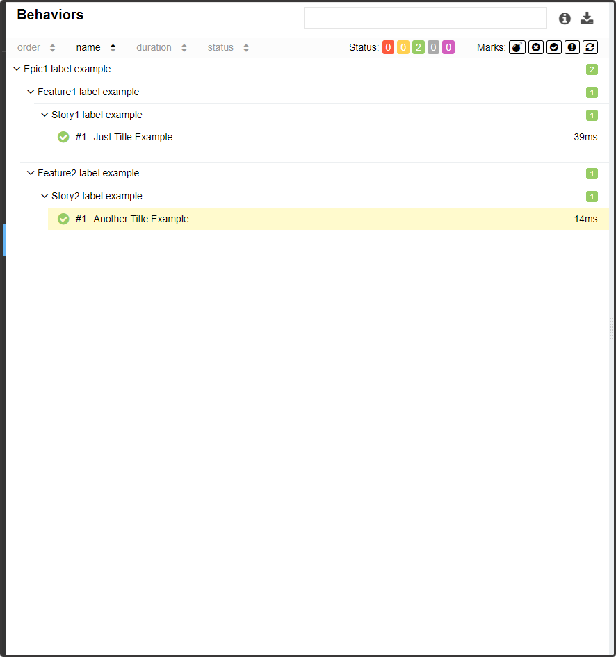
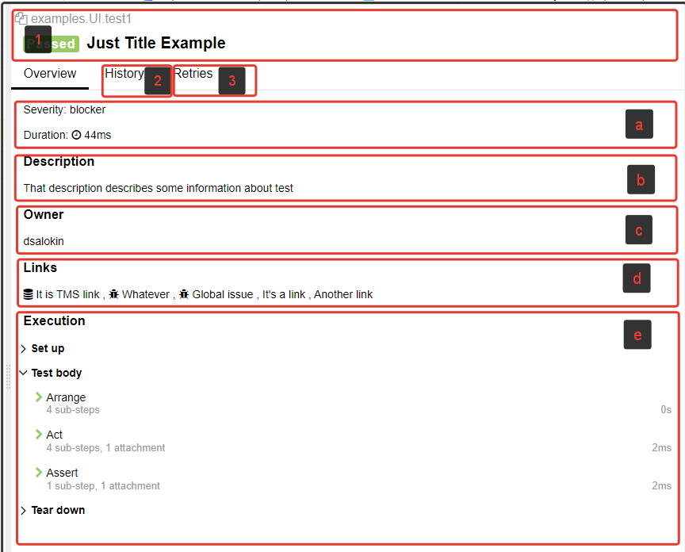

# Test result page

This is the place where you can read the most detailed report of the selected test result and its environment.

## Tree control pannel

This panel allows you to sort, group and download current tree content.

1. Search
2. Toggle group info
3. Download CSV
4. Tree sorting
5. [Status](../../gettingstarted_2/quickstart_2#test-execution)
6. [Marks](../../gettingstarted_2/features_2#flaky-tests)

## Tree content

Is a tree-like list of tests, the view depends on which of the main tabs you are on now: [Categories](../helicopterview#categories), [Suites](../helicopterview#suites), [Behaviors](../helicopterview#behaviors) or [Packages](../helicopterview#packages)

## Test result section

Provides information about selected result.

1. Common info
2. History section. Provides access to previous results.
3. Retries show result of several re-runs.

Overview shows result of last test run:

- a - [Categories](../helicopterview#categories), Severity and Duration time
- b - Description
- c - Owner
- d - Links
- e - Execution that contains Test body and Fixtures.
