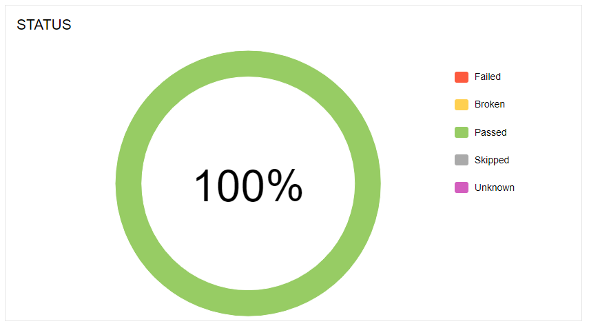

# Widgets

This is an important part to improve the understanding and analysis of large amounts of information.
## Status

Distribution of tests by status and common succes rate.

## Severity

Distribution of tests by [Severity](../gettingstarted/features).

## Duration

Distribution of tests by execution time.

## Duration trend

# Show us ...

## Retries trend

# Show us ...

## Categories trend

# Show us ...

## History trend

# Show us ...

## Timeline

Information about order and duration of tests execution.

Also you can select what tests will shown by duration and adjust the time range by using scales 1 and 2.

