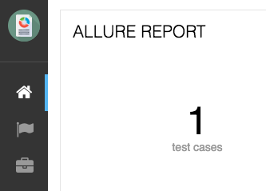

Several important Allure features are implemented as decoupled plugins
that are stored independently under the `plugins` folder of Allure
Commandline distribution. Their usage can be managed by build profiles
functionality (jump to the (link to the section)\[Commandline
configuration\]).

## Custom Logo

Let’s start with studying how one of the simplest plugins works. In
this section we will quickly examine a plugin available in the Allure
distribution which allows you to change a logo picture shown in the
upper-left corner of the report.



plugin sources directory structure:

    /src
        /dist
            allure-plugin.yml
            /static
                custom-logo.svg
                styles.css
        build.gradle

**allure-plugin.yml.**

```yaml
id: custom-logo
name: Custom logo aggregator
description: The aggregator replaces default Allure logo with a custom one
cssFiles:
  - styles.css
```

-   **custom-logo.svg** - is a vector graphics file with a logo to use

-   **styles.css** - a css file that adds the style, that will override
    default logotype.

**styles.css.**

```css
.side-nav__brand {
  background: url('custom-logo.svg') no-repeat left center;
  margin-left: 10px;
}
```

## Behaviors

Behaviors plugin is created to support behavior-driven approach in
testing with Allure report. Test cases should have Feature and Story
labels, that plugin will aggregate and create a widget showing
statistics of stories results per every feature, and a new tab, where
all test results are grouped by their features and stories.

-   In Java-based adaptors you can mark your tests with `@Feature` and
    `@Story` annotations.

-   In JS-based adaptors you can use `allure.feature(featureName)` and
    `allure.story(storyName)` methods

-   In CucumberJVM Features and Stories are extracted exactly as the
    tests are organized in Features and Scenarios.

Once your tests are properly labeled, you can start using Behaviors
plugin right away since it is included in Allure distribution by
default. You can find plugin sources in the [plugins folder of the Allure 2 project](https://github.com/allure-framework/allure2/tree/master/plugins)

Behaviors plugin structure:

    /src
        /dist
            allure-plugin.yml
            /static
                index.js
        /main
            /java
                /io.qameta.allure.behaviors
                    BehaviorsPlugin.java
        build.gradle

**BehavioursPlugin.java**

This plugin creates a different representation for the test results
tree, that is why its `BehaviorsPlugin` class inherits from a base class
providing tree aggregation - `AbstractTreeAggregator` and implements a
`Widget` interface to prepare the data for a widget on the Overview
report dashboard.

-   To provide aggregation classifier, plugin should implement a method
    `List<TreeGroup> getGroups(final TestResult result)`

```java
@Override
protected List<TreeGroup> getGroups(final TestResult result) {
    return Arrays.asList(
            TreeGroup.allByLabel(result, LabelName.FEATURE, DEFAULT_FEATURE),
            TreeGroup.allByLabel(result, LabelName.STORY, DEFAULT_STORY)
    );
}
```

This groups will determine a placement for every `TestResult` when
building a tree of regrouped results to store in the `behaviors.json`
file.

-   Another part of `BehaviorsPlugin` class is a `getData` method that
    comprises implementation of `Widget` interface. This method prepares
    aggregated information on amount of passed stories per every
    feature, that will be put into the `widget.json` file.

**index.js**

After that, in the `index.js` api calls for creation of a new tab and
creation of a new widget are as follows:

```js
allure.api.addTab('behaviors', {
    title: 'tab.behaviors.name', icon: 'fa fa-list',
    route: 'behaviors(/:testcaseId)',
    onEnter: (function () {
        var routeParams = Array.prototype.slice.call(arguments);
        return new allure.components.TreeLayout({
            routeParams: routeParams,
            tabName: 'tab.behaviors.name',
            baseUrl: 'behaviors',
            url: 'data/behaviors.json'
        });
    })
});

allure.api.addWidget('behaviors', allure.components.WidgetStatusView.extend({
    title: 'widget.behaviors.name',
    baseUrl: 'behaviors',
    showLinks: false,
    showAllText: 'widget.behaviors.showAll'
}));
```

Note a special `TreeLayout` component that can be used for displaying
all types of data, produced by implementations of
`AbstractTreeAggregator`. Also, a `route` attribute defines a pattern
for links to the test case pages.


## Junit

Junit plugin works without a front-end part, it is created to enable
Allure generator to process junit report xml format into the Allure test
results, this plugin is enabled by default, so when you use
`allure generate` command for a folder with junit test results, a report
will be generated.
