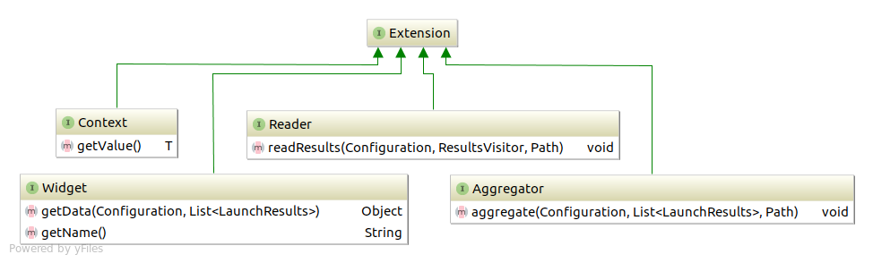

Let’s take a look into the class diagram of the top classes in the
Allure plugins system.

Plugin classes can extend 3 basic interfaces that provide different
aspects of functionality:

-   **Reader** allows to implement a `readResults` method, which defines
    the logic of reading results with `ResultsVisitor` instance from the
    directory with test results.

-   **Aggregator** allows to implement `aggregate` method, which defines
    the logic of aggregating processed results across all the results
    folders, and write resulting data to the report directory.

-   **Widget** this interface allows to implement `getData` method which
    again defines the logic of processed results aggregation but this
    time resulting data is saved into the `widget.json` file to be used
    by the widget named accordingly to the value supplied in `getName`.

-   **Context&lt;T&gt;** interface with `T getValue()` method enables to
    create some utility class to be used for all plugins via a method
    `Configuration.requireContext(Class<T>)` available from a
    Configuration instance, provided as a parameter in all of the 3
    methods above.
