## Installation

First part of installation guide concerns global installation of Allure
plugin and it’s commandline tool. Note that unlike to previous versions
Jenkins Allure Plugin since 2.11 does not require to configure Jenkins
Content Security Policy properties.

1.  Install the latest version of [Allure Plugin](https://wiki.jenkins-ci.org/display/JENKINS/Allure+Plugin)
    from "Plugin Manager" page.

2.  Open Plugin Advanced Settings (at
    **&lt;your\_jenkins\_host&gt;/pluginManager/advanced**).

3.  Click "Check Updates" button on the bottom right corner of the page.

4.  Configure Allure Commandline from "Global Tools Configuration".

### Build agents have connection to Maven repository with Allure distribution

1.  Open "Global Tool Configuration".

2.  Find "Allure Commandline" configuration block.

    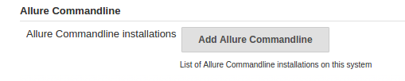

3.  Click "Add Allure Commandline" button.

    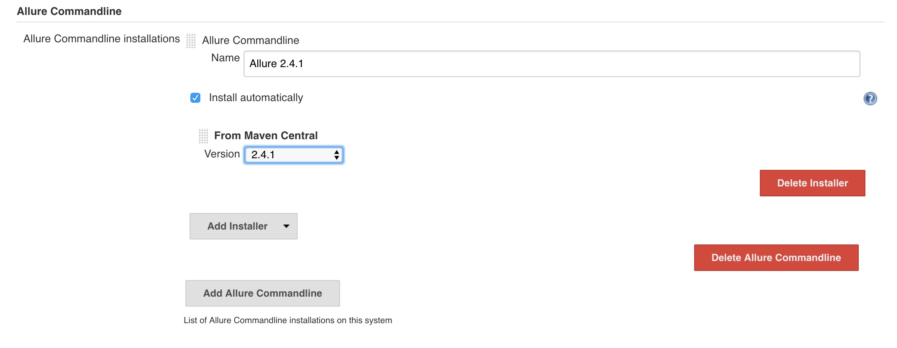

4.  Fill the name and choose the version in the "From Maven Central"
    dropdown.

The same can be done with system groovy using this script:

```groovy
import ru.yandex.qatools.allure.jenkins.tools.*
import hudson.tools.InstallSourceProperty
import hudson.tools.ToolProperty
import hudson.tools.ToolPropertyDescriptor
import hudson.util.DescribableList

def isp = new InstallSourceProperty()
def autoInstaller = new AllureCommandlineInstaller("2.6.0")
isp.installers.add(autoInstaller)

def proplist = new DescribableList<ToolProperty<?>, ToolPropertyDescriptor>()
proplist.add(isp)

def installation = new AllureCommandlineInstallation("allure260", "", proplist)


def allureDesc = jenkins.model.Jenkins.instance.getExtensionList(AllureCommandlineInstallation.DescriptorImpl.class)[0]


allureDesc.setInstallations(installation)
allureDesc.save()
```

### Downloading and installing Allure from archive

1.  Go to the [Maven Central page](https://repo.maven.apache.org/maven2/io/qameta/allure/allure-commandline/),
    click the latest released version, and download the
    allure-commandline-\[version\].zip file.

2.  (for older releases, ⇐ 2.8.0) Go to the [Bintray page](https://bintray.com/qameta/generic/allure2), click the desired
    version, and download the allure-\[version\].zip file.

3.  Upload downloaded file to any file server. Build agents must have
    access to the file by url.

4.  Open "Global Tool Configuration". and find "Allure Commandline"
    configuration block.

5.  Click "Add Allure Commandline" button.

    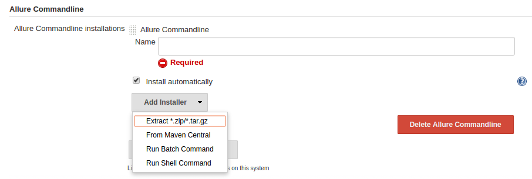

6.  Click "Add Installer" and choose "Extract **.zip/**.tar.gz".

    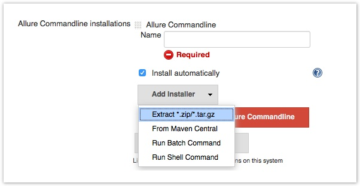

7.  Fill the name and download url. Mind that Jenkins will check the
    provided url immediately and show a warning if it’s not available.

    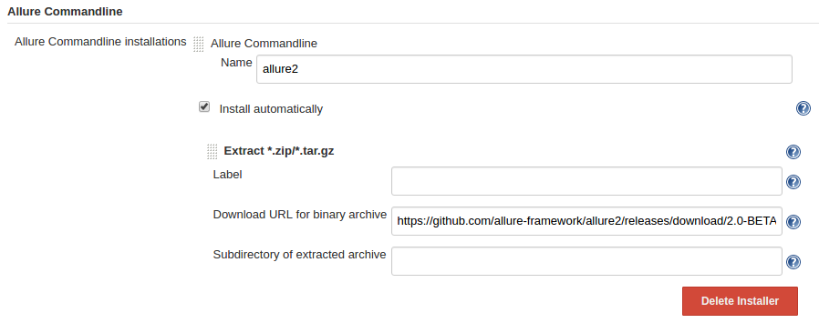

## Configuration

### Job configuration

1.  Open job configuration page.

2.  Ensure that your build generates some data in one of the formats
    digestible for Allure Commandline tool.

3.  Add **Allure Report** post build action.

    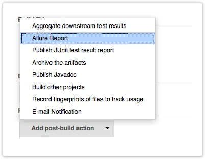

4.  Configure the Allure Report.

    

### Test Management and Bug-Tracking systems integrations

Currently all versions of Allure support setting of url patterns to make
direct links to your TMS or bug-tracker available from the report.
(Learn more about this integrations link-\[here\]) It may be done by
setting special system properties:

1.  **allure.tests.management.pattern** property:

    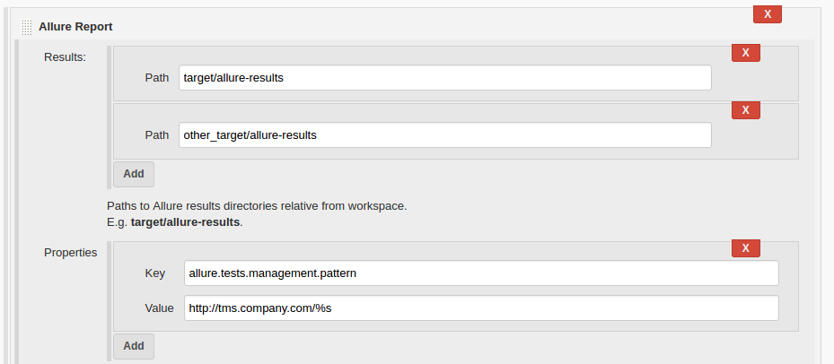

2.  **allure.issues.tracker.pattern** property:

    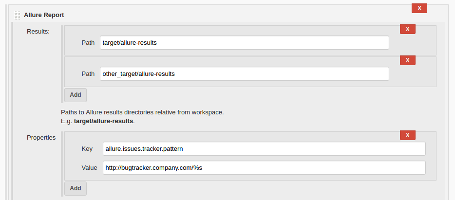

in both patterns **%s** will be substituted for a string value obtained
from the label added to test case.

### Advanced Options

"Advanced…​" button provides you with several additional settings:

-   jdk to use

-   build policy value

-   include environment flag - **currently is not implemented**

-   report path - You can specify the report output folder. Currently it
    is strictly NOT recommend to modify this value. You will lose the
    previous history information when change this value.

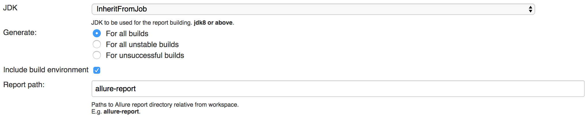

## Usage

When build is finished a link to Allure report will appear on the build
page and also in the build history entries:

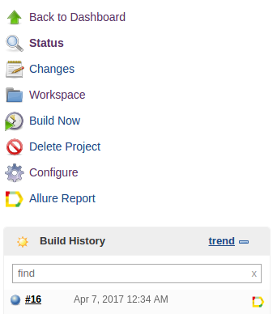

Generated Allure report is stored in the artifacts folder of the build
and can be processed the same way as all the other artifacts, or
downloaded as .zip archive.

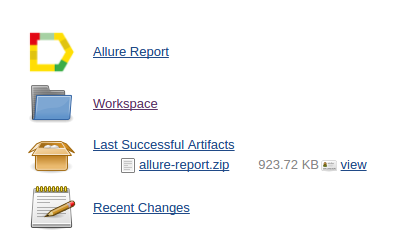

## History files

Allure since version 2 supports history for tests in the report \[Learn
more about History plugin\]. At the every report generation during the
build Jenkins Allure Plugin will try to access working directory of the
previous build and copy contents of `allure-report\history` folder to
the current report contents. At the moment history entry for test case
stores information about up to 5 previous results.

## Extensions

### Job DSL Plugin

The [job-dsl-plugin](https://github.com/jenkinsci/job-dsl-plugin/wiki)
allows the programmatic creation of projects using a DSL.

```dsl
// default
publishers {
    allure(['allure-results'])
}

// advanced
publishers {
    allure(['first-results', 'second-results']) {
        jdk('java7')
        commandline('1.4.18')

        buildFor('UNSTABLE')
        includeProperties(true)
        property('allure.issues.tracker.pattern', 'http://tracker.company.com/%s')
        property('allure.tests.management.pattern', 'http://tms.company.com/%s')
    }
}
```

### Pipeline Plugin

To add Allure report generation from pipeline steps one can use Pipeline
Syntax builder to generate Allure step code. Note, that `commandline`
parameter points to Allure Commandline installation name to use, if it
is not provided, plugin will pick first suitable installation found
automatically.

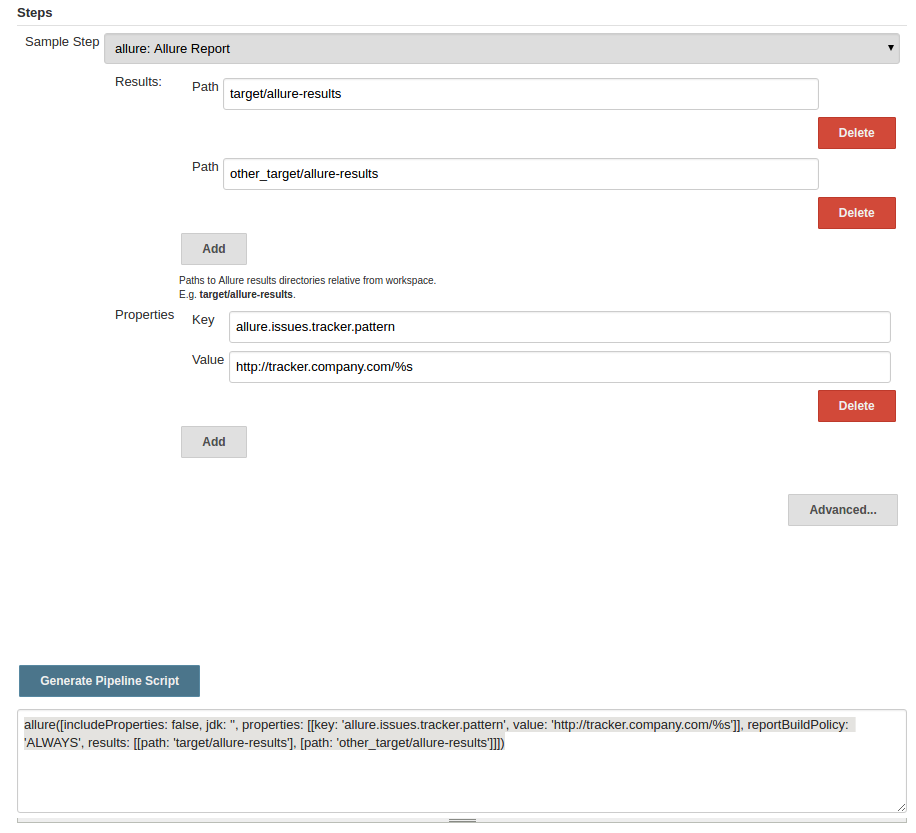

which gives a pipeline script:

```dsl
node {
// script body

allure([
         includeProperties: false,
         jdk: '',
         properties: [[key: 'allure.issues.tracker.pattern', value: 'http://tracker.company.com/%s']],
         reportBuildPolicy: 'ALWAYS',
         results: [[path: 'target/allure-results'], [path: 'other_target/allure-results']]
         ])
}
```

To use Allure Report from the pipeline steps one can invoke Allure DSL
method as script:

```dsl
stage('reports') {
    steps {
    script {
            allure([
                    includeProperties: false,
                    jdk: '',
                    properties: [],
                    reportBuildPolicy: 'ALWAYS',
                    results: [[path: 'target/allure-results']]
            ])
    }
    }
}
```
