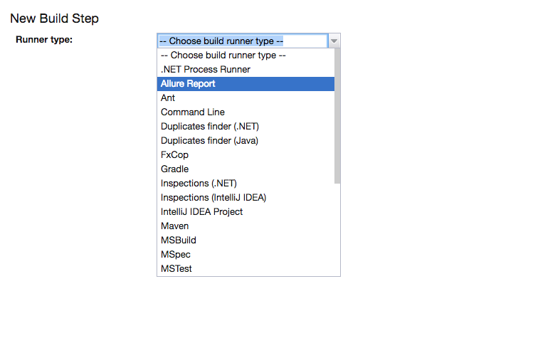
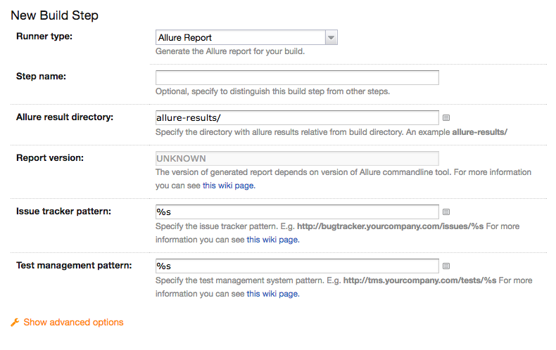
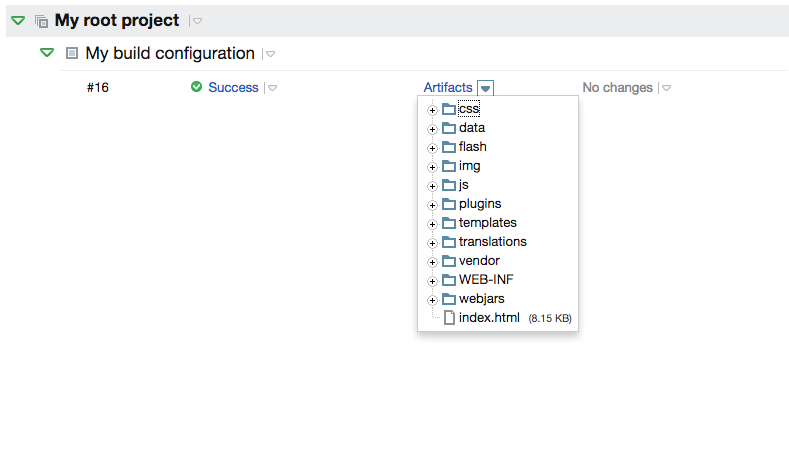

## Installation

1.  [Install Allure TeamCity plugin](https://confluence.jetbrains.com/display/TCD18/Installing+Additional+Plugins).

2.  Download the latest `allure-commandline-x.x.zip` from [latest release](https://repo.maven.apache.org/maven2/io/qameta/allure/allure-commandline/)

3.  Copy downloaded file to the [TeamCity Data Directory](https://confluence.jetbrains.com/display/TCD18/TeamCity+Data+Directory)&gt;/plugins/.tools)
    directory as `allure-commandline.zip`. No server restart needed for
    this step.

if agents have not received the allure-commandline so we can do it
manually for every agent . create allure-commandline folder in
/opt/TeamCity/buildAgent/tools . unzip archive to allure-commandline
folder . grant permissions 755 and teamCity:teamcity for all folders .
reboot agent

## Configuration

1.  Open the build **configuration settings**.

2.  Ensure that your build [generates Allure XML files](https://github.com/allure-framework/allure-core/wiki#gathering-information-about-tests).

3.  Go to **Build steps** and add the **Allure Report** build step.

4.  (optional) In **Execute step:** select **Even if some of the
    previous steps failed** to generate report for failing tests as
    well.

    

5.  Configure the step.

    

In case you upgrading the Allure TeamCity plugin you need to remove old
Allure report generation feature.

## Usage

When the build is done you will get Allure Report as a part of build
artifacts – simply open the index.html.

