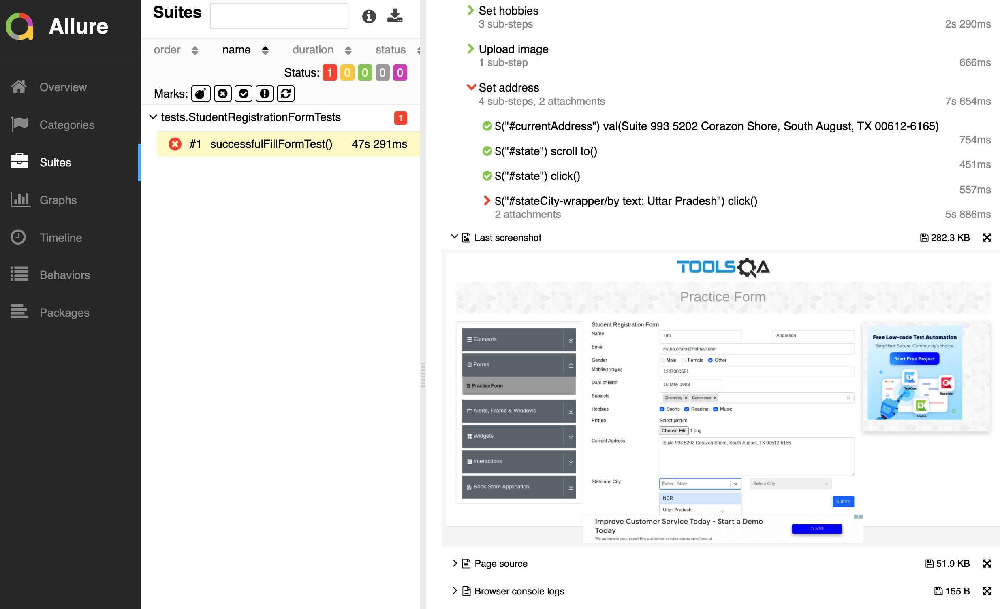

# Why?

Okay. There is (or could be, but we're pretty certain there is) a huge gap between you automated tests results and the people which are consuming the results of your tests (that could be not only you, huh).

## Instead of thousand words

Here is an example of a test class with 1 failing test of JUnit5

```xml
<?xml version="1.0" encoding="UTF-8"?>
<testsuite name="io.qameta.allure.IssuesWebTest" tests="3" skipped="0" failures="1" errors="0" timestamp="2022-03-28T10:49:35" hostname="local.pc" time="3.039">
  <properties/>
  <testcase name="shouldAddLabelToIssue()" classname="io.qameta.allure.IssuesWebTest" time="1.019">
    <failure message="org.opentest4j.AssertionFailedError: Element should have text 'Some issue title here' {By.xpath: //a[@href='/eroshenkoam/allure-example']}&#10;Element: '&lt;a class=&quot;v-align-middle&quot;&gt;another text&lt;/a&gt;'&#10;Screenshot: file:/Users/eroshenkoam/Developer/eroshenkoam/webdriver-coverage-example/build/reports/tests/1603973703632.0.png&#10;Page source: file:/Users/eroshenkoam/Developer/eroshenkoam/webdriver-coverage-example/build/reports/tests/1603973703632.0.html&#10;Timeout: 4 s.&#10;" type="org.opentest4j.AssertionFailedError">org.opentest4j.AssertionFailedError: Element should text 'Some issue title here' {By.xpath: //a[@href='/eroshenkoam/allure-example']}
Element: '&lt;a class=&quot;v-align-middle&quot;&gt;another text&lt;/a&gt;'
Screenshot: file:/Users/eroshenkoam/Developer/eroshenkoam/webdriver-coverage-example/build/reports/tests/1603973703632.0.png
Page source: file:/Users/eroshenkoam/Developer/eroshenkoam/webdriver-coverage-example/build/reports/tests/1603973703632.0.html
Timeout: 4 s.

	at org.junit.jupiter.api.AssertionUtils.fail(AssertionUtils.java:39)
	at org.junit.jupiter.api.Assertions.fail(Assertions.java:134)

</failure>
  </testcase>
  <testcase name="shouldCreateIssue()" classname="io.qameta.allure.IssuesWebTest" time="1.006"/>
  <testcase name="shouldCloseIssue()" classname="io.qameta.allure.IssuesWebTest" time="1.007"/>
  <system-out><![CDATA[]]></system-out>
  <system-err><![CDATA[]]></system-err>
</testsuite>

```

Or an example of a Pytest's test execution with a failure

```bash

issues_web_test.py::test_should_create_issue PASSED [ 16%]PASSED [ 33%]PASSED [ 50%]PASSED [ 66%]FAILED                      [ 83%]
test/issues_web_test.py:50 (test_should_create_issue)
web_driver = None

    def test_should_create_issue(web_driver):
        steps.open_issues_page(OWNER, REPO)
>       steps.create_issue_with_title(ISSUE_TITLE)

issues_web_test.py:60: 
_ _ _ _ _ _ _ _ _ _ _ _ _ _ _ _ _ _ _ _ _ _ _ _ _ _ _ _ _ _ _ _ _ _ _ _ _ _ _ _ 
steps/web_steps.py:40: in create_issue_with_title
    maybe_throw_assertion_exception(title)
_ _ _ _ _ _ _ _ _ _ _ _ _ _ _ _ _ _ _ _ _ _ _ _ _ _ _ _ _ _ _ _ _ _ _ _ _ _ _ _ 

text = 'Some issue title here'

    def maybe_throw_assertion_exception(text):
        if is_time_to_trow_exception():
>           pytest.fail(text_equal.format(expected=text, actual="another text"))
E           Failed: Element should text 'Some issue title here' {By.xpath: //a[@href='/eroshenkoam/allure-example']}
E           Element: '<a class="v-align-middle">another text</a>'
E           Screenshot: file:/Users/eroshenkoam/Developer/eroshenkoam/webdriver-coverage-example/build/reports/tests/1603973703632.0.png
E           Page source: file:/Users/eroshenkoam/Developer/eroshenkoam/webdriver-coverage-example/build/reports/tests/1603973703632.0.html
E           Timeout: 4 s.

```

Now, imagine someone living in a galaxy far far away from the coding wants to see what is happening inside your tests. Someone called a manager or even an Analyst.

Imagined?

Now, imagine yourself in a happy place, where you don't need to go line by line explaining what is happening, what this error means, on which step the test failed and how the UI looked like when it failed.

This place has a name, it's Allure Report.



Based on the test results Allure Report creates human readable report containing the following:

- Test's status (successfully passed or failed)
- Information about test's scenario (steps in our terminology)
  - with direct marks of failed tests
  - with human readable steps descriptions and actions descriptions as it is set in your code
  - with additional information like screenshots, logs and other attachments you can use
- Groupings of tests based on your code or based on the annotations you've added to your code
- and many more.

The detailed description of Allure Report is done here: 
